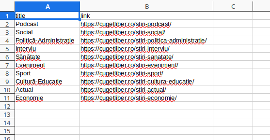

# Web Scraper - News Titles

Simple script that fetches titles and links from a news page and saves them to CSV.

Files:
- `scraper.py` - main script
- `example.csv` - example data

## Installation
1. Install dependencies:

pip install -r requirements.txt

## Usage
python3 scraper.py https://cugetliber.ro 10 output.csv

